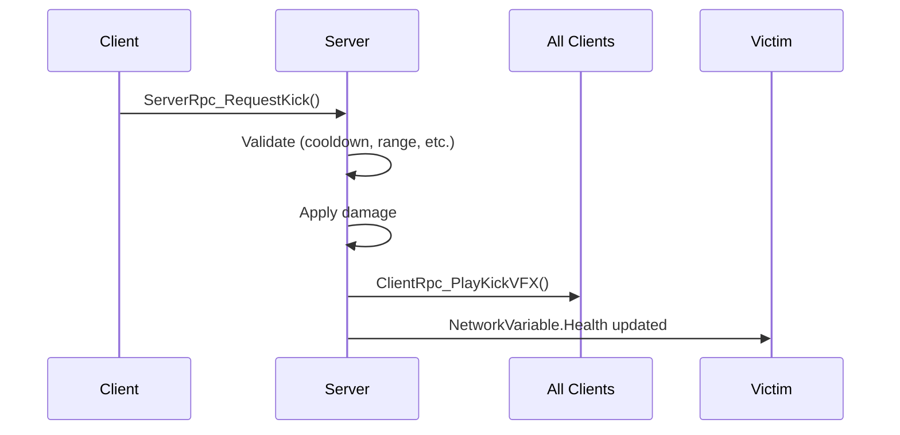

# 🏗️ Architecture Technique - Kick Flight: Reborn

Ce document décrit l'architecture technique complète du projet Kick Flight: Reborn.

---

## 📋 Table des Matières

1. [Vue d'Ensemble](#vue-densemble)
2. [Stack Technique](#stack-technique)
3. [Architecture Réseau](#architecture-réseau)
4. [Structure du Code](#structure-du-code)
5. [Systèmes Principaux](#systèmes-principaux)
6. [Performance & Optimisation](#performance--optimisation)
7. [Sécurité](#sécurité)

---

## 🎯 Vue d'Ensemble

### Architecture Générale

```
┌─────────────┐         ┌─────────────┐
│   Client    │◄───────►│   Server    │
│   (Unity)   │  Netcode│  (Unity)    │
└─────────────┘         └─────────────┘
      │                       │
      │                       │
   ┌──▼──┐                ┌──▼──┐
   │ GPU │                │ DB  │
   └─────┘                └─────┘
```

### Principes de Design

- **Client-Server Autoritatif** - Le serveur a l'autorité finale
- **Client Prediction** - Mouvement fluide avec réconciliation
- **Event-Driven** - Architecture basée sur les événements
- **Component-Based** - Design modulaire Unity ECS-like
- **Performance First** - 60 FPS minimum sur mobile moyen

---

## 🛠️ Stack Technique

### Moteur de Jeu

**Unity 2022.3 LTS**
- Template: 3D (URP)
- Render Pipeline: Universal Render Pipeline
- Color Space: Linear
- Graphics API: Metal (iOS), Vulkan (Android)

### Packages Unity Essentiels

| Package | Version | Usage |
|---------|---------|-------|
| Netcode for GameObjects | 1.7.0+ | Multijoueur temps réel |
| Input System | 1.7.0+ | Système d'input cross-platform |
| Cinemachine | 2.9.0+ | Caméra dynamique |
| TextMeshPro | 3.0.0+ | Rendu texte UI |
| Universal RP | 14.0.0+ | Pipeline de rendu |
| ProBuilder | 5.0.0+ | Level design prototyping |

### Langage & Frameworks

- **C# 9.0** - Langage principal
- **.NET Standard 2.1** - Framework
- **Unity Jobs System** - Multithreading (futur)
- **Burst Compiler** - Optimisation performance (futur)

---

## 🌐 Architecture Réseau

### Modèle: Client-Server Autoritatif

#### Pourquoi ce choix ?

✅ **Avantages:**
- Anti-cheat intégré (validation serveur)
- Synchronisation garantie
- Scalabilité (serveurs dédiés)
- Lag compensation possible

❌ **Inconvénients:**
- Latence visible si mauvaise connexion
- Coûts serveur (mitigés par hosting communautaire)

### Netcode for GameObjects

```csharp
// Architecture de base
NetworkManager
├── NetworkObject (sur chaque entité réseau)
├── NetworkVariable<T> (données synchronisées)
├── ServerRpc (client → serveur)
└── ClientRpc (serveur → clients)
```

### Synchronisation des Données

| Donnée | Type | Fréquence | Direction |
|--------|------|-----------|-----------|
| Position/Rotation | NetworkTransform | 20 Hz | Bidirectionnel |
| Health/Shield | NetworkVariable | On Change | Server → Client |
| Inputs | RPC | 60 Hz | Client → Server |
| Dégâts | ServerRpc | On Event | Client → Server |
| Effets VFX | ClientRpc | On Event | Server → Client |

### Flow de Communication

#### Exemple: Attaque d'un joueur



### Gestion de la Latence

**Client Prediction:**
```csharp
// Le mouvement se fait en local immédiatement
void Update()
{
    if (IsOwner)
    {
        // Prédiction locale
        ApplyMovementLocally();

        // Envoyer au serveur pour validation
        SendMovementToServerRpc();
    }
}
```

**Server Reconciliation:**
- Le serveur envoie la position autoritaire
- Le client compare avec sa prédiction
- Si différence > seuil, correction smooth

**Lag Compensation:**
- Enregistrement des positions passées (buffer 200ms)
- Raycast sur position historique basée sur ping
- Validation serveur avec tolérance

---

## 📁 Structure du Code

### Organisation des Dossiers

```
Assets/_Project/
│
├── Scripts/
│   ├── Core/
│   │   ├── GameManager.cs              # Singleton, gère l'état global
│   │   ├── NetworkGameManager.cs       # Gestion réseau du jeu
│   │   └── SceneLoader.cs              # Chargement asynchrone scènes
│   │
│   ├── Player/
│   │   ├── KickerHealth.cs             # Système de santé
│   │   ├── KickerController.cs         # Controller principal
│   │   ├── KickerData.cs               # ScriptableObject stats
│   │   └── KickerAbility.cs            # Base class capacités
│   │
│   ├── Movement/
│   │   ├── AerialMovement.cs           # Physique vol libre
│   │   ├── GroundMovement.cs           # Mouvement au sol (spawn)
│   │   └── MovementConfig.cs           # Configuration mouvement
│   │
│   ├── Combat/
│   │   ├── CombatSystem.cs             # Système de combat
│   │   ├── HitDetection.cs             # Détection des coups
│   │   ├── DamageCalculator.cs         # Calculs de dégâts
│   │   └── ComboSystem.cs              # Gestion des combos
│   │
│   ├── Network/
│   │   ├── NetworkPlayer.cs            # Component réseau joueur
│   │   ├── NetworkTransformCustom.cs   # Transform sync custom
│   │   ├── LagCompensation.cs          # Système lag compensation
│   │   └── NetworkEvents.cs            # Events réseau globaux
│   │
│   ├── UI/
│   │   ├── HUD/
│   │   │   ├── HealthBar.cs
│   │   │   ├── CooldownDisplay.cs
│   │   │   └── ScoreDisplay.cs
│   │   ├── Menus/
│   │   │   ├── MainMenu.cs
│   │   │   ├── LobbyMenu.cs
│   │   │   └── CharacterSelect.cs
│   │   └── UIManager.cs                # Gestion UI globale
│   │
│   ├── Camera/
│   │   ├── CameraController.cs         # Contrôle caméra principale
│   │   ├── CameraShake.cs              # Effets de shake
│   │   └── TargetTracking.cs           # Suivi de cible
│   │
│   ├── Game/
│   │   ├── Arena/
│   │   │   ├── ArenaManager.cs         # Gestion de l'arène
│   │   │   ├── SpawnPoint.cs           # Points de spawn
│   │   │   └── ArenaZone.cs            # Zones spéciales
│   │   ├── Crystal/
│   │   │   ├── CrystalSpawner.cs
│   │   │   └── CrystalCollectible.cs
│   │   └── Matchmaking/
│   │       ├── MatchmakingManager.cs
│   │       └── TeamBalancer.cs
│   │
│   └── Utilities/
│       ├── ObjectPool.cs               # Object pooling
│       ├── Extensions.cs               # Extension methods
│       ├── Constants.cs                # Constantes globales
│       └── Debug/
│           ├── DebugMenu.cs
│           └── NetworkDebugger.cs
│
├── Prefabs/
│   ├── Characters/
│   │   └── Player.prefab               # Prefab joueur complet
│   ├── Environment/
│   └── UI/
│
├── ScriptableObjects/
│   ├── Kickers/
│   │   ├── AgileKicker.asset
│   │   └── TankKicker.asset
│   └── Arenas/
│
├── Scenes/
│   ├── Bootstrap.unity                 # Scène de démarrage
│   ├── MainMenu.unity
│   ├── Lobby.unity
│   └── Arenas/
│       └── TestArena.unity
│
└── Settings/
    ├── InputActions/
    │   └── KickerControls.inputactions
    └── URP/
        └── UniversalRP-HighQuality.asset
```

### Conventions de Code

**Naming:**
```csharp
// Classes: PascalCase
public class KickerHealth { }

// Methods: PascalCase
public void TakeDamage(int amount) { }

// Private fields: camelCase avec _
private float _currentHealth;

// Public fields/properties: PascalCase
public float MaxHealth { get; set; }

// Constants: UPPER_SNAKE_CASE
private const int MAX_COMBO_COUNT = 3;

// Events: On + PascalCase
public event Action OnHealthChanged;
```

**Régions:**
```csharp
#region Serialized Fields
[SerializeField] private float maxHealth = 100f;
#endregion

#region Network Variables
private NetworkVariable<float> _health;
#endregion

#region Unity Callbacks
private void Update() { }
#endregion

#region Public Methods
public void TakeDamage(int amount) { }
#endregion

#region Network RPCs
[ServerRpc]
private void TakeDamageServerRpc() { }
#endregion
```

---

## 🎮 Systèmes Principaux

### 1. Système de Mouvement

**Architecture:**
```csharp
AerialMovement (MonoBehaviour, NetworkBehaviour)
├── Input handling (Input System)
├── Physics calculation (custom, pas Rigidbody)
├── Network synchronization (NetworkTransform custom)
└── Animation updates (Animator parameters)
```

**Features:**
- Vol en 6 degrés de liberté (pitch, yaw, roll)
- Boost system avec consommation d'énergie
- Dash avec cooldown et invincibility frames
- Gravité customisée pour gameplay arcade
- Tilt automatique basé sur le mouvement

**Performance:**
- Pas de Rigidbody (trop lent pour ce type de mouvement)
- Physique custom avec CharacterController
- Interpolation smooth pour le réseau

### 2. Système de Combat

**Architecture:**
```csharp
CombatSystem
├── Input detection
├── Validation (range, cooldown)
├── Hit detection (SphereCast)
├── Damage calculation
├── Network synchronization
└── VFX/SFX triggers
```

**Combo System:**
```
Kick 1 → Kick 2 → Kick 3 → Special
(1x)     (1.2x)    (1.5x)    (2x damage)
```

**Hit Detection:**
- SphereCast pour la détection
- Layermask pour filtrer (PlayerLayer uniquement)
- Validation serveur pour anti-cheat
- Lag compensation pour fairness

### 3. Système de Santé

**Architecture:**
```csharp
KickerHealth (NetworkBehaviour)
├── Health NetworkVariable
├── Shield NetworkVariable (optionnel)
├── Damage validation (serveur)
├── Death handling
├── Respawn automatique
└── Events pour UI
```

**Features:**
- Shield régénératif après délai
- Invulnérabilité au spawn
- Respawn automatique après mort
- Events pour feedback visuel/audio

### 4. Network Manager

**Responsabilités:**
- Gestion des connexions
- Spawn des joueurs
- Synchronisation des états
- Matchmaking basique
- Anti-cheat

**Flow de Connexion:**
```
1. Client connect to Server
2. Server validates
3. Server spawns NetworkObject for player
4. Client receives ownership
5. Game starts
```

### 5. Input System

**Configuration:**
```csharp
KickerControls.inputactions
├── Player (Action Map)
│   ├── Movement (Vector2)
│   ├── Look (Vector2)
│   ├── Kick (Button)
│   ├── Boost (Button)
│   ├── Dash (Button)
│   ├── Ability1 (Button)
│   ├── Ability2 (Button)
│   └── Ultimate (Button)
```

**Control Schemes:**
- Keyboard & Mouse
- Gamepad (Xbox/PlayStation)
- Touch (mobile - à implémenter)

---

## ⚡ Performance & Optimisation

### Targets de Performance

| Platform | Target FPS | Resolution | Graphics |
|----------|------------|------------|----------|
| High-end Mobile | 60 FPS | 1080p | High |
| Mid-range Mobile | 60 FPS | 720p | Medium |
| Low-end Mobile | 30 FPS | 540p | Low |
| Desktop | 120 FPS | 1440p+ | Ultra |

### Techniques d'Optimisation

**1. Object Pooling**
```csharp
// Pour projectiles, VFX, SFX
ObjectPool<GameObject> _vfxPool;
GameObject effect = _vfxPool.Get();
// Use it
_vfxPool.Release(effect);
```

**2. LOD (Level of Detail)**
- LOD0: 0-20m (full detail)
- LOD1: 20-50m (medium)
- LOD2: 50-100m (low)
- Culling: >100m

**3. Occlusion Culling**
- Baking occlusion data pour les arènes
- Dynamique pour les personnages

**4. Draw Call Batching**
- Static batching pour l'environnement
- GPU instancing pour les effets

**5. Texture Atlasing**
- Combiner textures similaires
- Reduce draw calls

**6. Network Optimization**
- Variable delta compression
- Compression des inputs
- Prioritization des updates (owner > others)

**7. Physics Optimization**
- Minimal use de Rigidbody
- Layer-based collision matrix
- Fixed Timestep: 0.02 (50Hz)

**8. Profiling**
- Unity Profiler pour CPU/GPU
- Network Profiler pour bandwidth
- Memory Profiler pour leaks

---

## 🔒 Sécurité

### Anti-Cheat Measures

**1. Server Authority**
- Toutes les actions critiques validées serveur
- Le client ne peut jamais modifier directement:
  - Health/Shield
  - Position (sauf prédiction, réconciliée)
  - Dégâts infligés
  - Score

**2. Validation des Inputs**
```csharp
[ServerRpc]
void KickServerRpc()
{
    // Validation cooldown
    if (Time.time - _lastKickTime < kickCooldown)
        return;

    // Validation range
    if (Vector3.Distance(transform.position, target) > kickRange)
        return;

    // OK, apply damage
    target.TakeDamage(kickDamage);
}
```

**3. Rate Limiting**
- Limite d'appels RPC par seconde
- Kick automatique si spam détecté

**4. Checksums**
- Vérification de l'intégrité des assets
- Hash des scripts critiques

**5. Obfuscation (Release)**
- Obfuscation du code IL2CPP
- Protection des constantes sensibles

### Mesures Additionnelles (Futur)

- Replay system pour review de matches suspects
- Report system communautaire
- Machine learning pour détection de patterns anormaux
- VAC-like system si budget le permet

---

## 📊 Diagrammes d'Architecture

### Flow du Gameplay Principal

```
┌─────────────────────────────────────────────────────────┐
│                    GAME LOOP                             │
└─────────────────────────────────────────────────────────┘
                          │
                          ▼
┌─────────────────────────────────────────────────────────┐
│  INPUT SYSTEM                                            │
│  - Read player inputs (60Hz)                             │
│  - Queue actions                                         │
└─────────────────┬───────────────────────────────────────┘
                  │
                  ▼
┌─────────────────────────────────────────────────────────┐
│  MOVEMENT SYSTEM                                         │
│  - Calculate velocity                                    │
│  - Apply physics                                         │
│  - Predict position (client)                             │
│  - Send to server                                        │
└─────────────────┬───────────────────────────────────────┘
                  │
                  ▼
┌─────────────────────────────────────────────────────────┐
│  COMBAT SYSTEM                                           │
│  - Detect attacks                                        │
│  - Check hit detection                                   │
│  - Request damage (ServerRpc)                            │
└─────────────────┬───────────────────────────────────────┘
                  │
                  ▼
┌─────────────────────────────────────────────────────────┐
│  NETWORK SYNC (Server authoritative)                     │
│  - Validate all actions                                  │
│  - Update NetworkVariables                               │
│  - Broadcast to clients                                  │
└─────────────────┬───────────────────────────────────────┘
                  │
                  ▼
┌─────────────────────────────────────────────────────────┐
│  RENDER & UI                                             │
│  - Update animations                                     │
│  - Play VFX/SFX                                          │
│  - Update HUD                                            │
└─────────────────────────────────────────────────────────┘
```

### Architecture de Données

```
┌─────────────────────────────────────────────────────────┐
│  SCRIPTABLE OBJECTS (Game Data)                          │
│                                                           │
│  KickerData (Stats base)                                 │
│  ├── Health, Speed, Damage                               │
│  └── Abilities references                                │
│                                                           │
│  AbilityData (Capacités)                                 │
│  ├── Cooldown, Range, Damage                             │
│  └── VFX/SFX references                                  │
│                                                           │
│  ArenaData (Arènes)                                      │
│  └── Spawn points, boundaries, theme                     │
└─────────────────────────────────────────────────────────┘
                          │
                          ▼
┌─────────────────────────────────────────────────────────┐
│  RUNTIME INSTANCES                                       │
│                                                           │
│  KickerController (Per player)                           │
│  ├── References KickerData                               │
│  ├── Runtime stats (current health, cooldowns)           │
│  └── Network sync                                        │
└─────────────────────────────────────────────────────────┘
```

---

## 🔄 Lifecycle des Objets Principaux

### Player Lifecycle

```
1. Client connects
   └─→ NetworkManager.OnClientConnected()

2. Server spawns player
   └─→ Instantiate(PlayerPrefab)
   └─→ NetworkObject.Spawn()
   └─→ Assign ownership to client

3. Player initialization
   └─→ Awake() - Initialize components
   └─→ Start() - Setup network vars
   └─→ OnNetworkSpawn() - Network ready
   └─→ Spawn at spawn point with invulnerability

4. Gameplay loop
   └─→ Update() - Input & movement
   └─→ FixedUpdate() - Physics
   └─→ NetworkUpdate() - Sync (20Hz)

5. Player death
   └─→ Health reaches 0
   └─→ Trigger death animation
   └─→ Disable controls
   └─→ Wait respawn delay
   └─→ Respawn at new spawn point

6. Player disconnect
   └─→ NetworkManager.OnClientDisconnected()
   └─→ NetworkObject.Despawn()
   └─→ Destroy GameObject
```

---

## 🧪 Testing Strategy

### Types de Tests

**1. Unit Tests**
- Logique de combat (calculs de dégâts)
- Système de combo
- Cooldown managers
- Utilities

**2. Integration Tests**
- Network sync
- Player spawn/despawn
- Scene loading

**3. Playtest Sessions**
- Performance testing
- Network latency simulation
- Gameplay balance
- Bug hunting

### Test Environments

- **Editor**: Tests rapides durant dev
- **Standalone Build**: Tests de performance
- **Mobile**: Tests sur devices réels
- **Network**: Tests avec latency simulator

---

## 📈 Métriques & Analytics

### Métriques Clés à Tracker

**Performance:**
- FPS moyen/min/max
- Frame time
- Network latency
- Packet loss
- Memory usage

**Gameplay:**
- Durée moyenne des matchs
- Kill/Death ratios
- Taux de victoire par Kicker
- Utilisation des capacités
- Zones chaudes de l'arène

**Engagement:**
- Sessions par jour
- Durée de session
- Taux de rétention
- Matchmaking time
- Abandon de match

---

## 🚀 Déploiement

### Build Pipeline

```
1. Development Build
   └─→ Tests unitaires
   └─→ Build Debug
   └─→ Tests d'intégration

2. Staging Build
   └─→ Build Release
   └─→ Tests de performance
   └─→ Beta testing interne

3. Production Build
   └─→ Optimisations finales
   └─→ Obfuscation
   └─→ Upload vers stores
```

### Platforms Cibles

- **iOS** (App Store)
- **Android** (Google Play)
- **Windows** (Steam / Itch.io)
- **macOS** (App Store / Steam)

---

## 📚 Ressources & Références

- [Unity Netcode Docs](https://docs-multiplayer.unity3d.com/)
- [Unity Best Practices](https://unity.com/how-to/programming-unity)
- [Game Programming Patterns](https://gameprogrammingpatterns.com/)
- [Mobile Optimization Guide](https://docs.unity3d.com/Manual/MobileOptimizationPracticalGuide.html)

---

**Dernière mise à jour:** Novembre 2025
**Auteur:** Kick Flight Community
**Version:** 1.0
